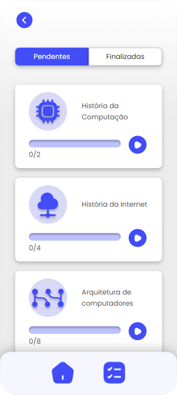
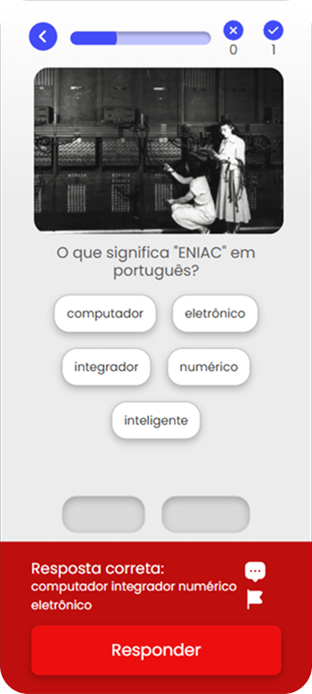
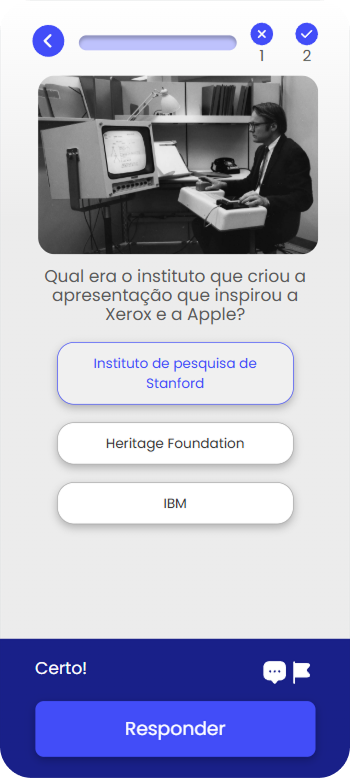

# Computer Education for Teenagers App

A React + TypeScript application for computer education, featuring tasks, quizzes, and user progress tracking.


|  |  |
|:---------------------------------------------:|:-----------------------------------------------------:|
| Home Screen                                   | Course Selector                                       |

|  |  |
|:-----------------------------------------------------:|:-------------------------------------------------------:|
| Course Description                                   | Additional Course Info                                 |

|  |  |  |
|:-----------------------------------------------------------:|:----------------------------------------------------------:|:-----------------------------------------------------------:|
| Incorrect Answer                                            | Correct Answer                                             | Incorrect Answer                                            |

---

## Folder Architecture

```
computer-education-for-teenagers-app/
├── public/
│   ├── index.html
│   └── manifest.json
├── src/
│   ├── assets/
│   ├── components/
│   │   ├── boxes/
│   │   ├── buttons/
│   │   ├── icons/
│   │   └── typography/
│   ├── config/
│   ├── contexts/
│   ├── pages/
│   │   ├── Dashboard/
│   │   ├── LandingPage/
│   │   ├── TaskExplanation/
│   │   └── Tasks/
│   ├── service/
│   ├── utils/
│   ├── index.css
│   ├── index.tsx
│   ├── globalStyle.ts
│   ├── routes.tsx
│   └── types.ts
├── .env.example
├── .gitignore
├── .prettierrc
├── eslint.config.mjs
├── package.json
├── package-lock.json
├── tsconfig.json
└── yarn.lock
```

---

## Main Libraries

- **React**: UI library for building user interfaces.
- **TypeScript**: Static type checking for JavaScript.
- **styled-components**: CSS-in-JS styling.
- **react-router-dom**: Routing for React apps.
- **axios**: HTTP client for API requests.
- **eslint**: Linting for code quality.
- **prettier**: Code formatting.
- **@testing-library/react**: Testing utilities for React.
- **@types/\***: TypeScript type definitions for libraries.
- **react-icons**: Icon library for React.
- **dotenv**: Environment variable management.
- **typescript-eslint**: ESLint plugin for TypeScript.
- **prettier-plugin-organize-imports**: Organizes imports automatically.

---

## Getting Started

1. Install dependencies:
   ```
   npm install
   ```
2. Start the development server:
   ```
   npm run dev
   ```
3. Build for production:
   ```
   npm run build
   ```

---

## License

MIT

